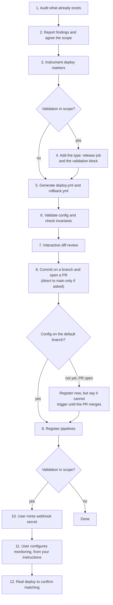

# Deploy setup

Instruments a repository for CircleCI deploy markers, generates deploy and rollback
pipelines, and wires up release validation webhooks. This is the editor-native equivalent
of the guided deploy setup in the CircleCI web app.

## Use the whole repository, not one job

The guided setup in the web app works from a single job's YAML, so it has to guess at
values like the deployed version and the target namespace from that one block.

You are not limited that way. Read `scripts/deploy.sh`, Helm values, Dockerfiles, Makefile
targets, and existing CI config, and infer those values from what the project actually
does. Fall back to a generic placeholder only when the repository genuinely does not say.
Show the user what you inferred so they can correct it — see [step 2](#step-2-report-findings-and-agree-the-scope).

## Order of operations



Steps 3 onward cover only what the user chose in step 2. Skip the rest without comment.

**All config work happens before the commit.** The `validation` block and its
`type: release` job are config changes, so they belong in step 4 — not alongside the
monitoring work in step 11. Committing first and discovering the release job is missing
means a second round trip through review and approval.

When validation is in scope, deploy markers must **not** include a deploy-job
`--status=SUCCESS` step for that plan — success is delegated to the release job. See
`references/validation.md` and `references/markers.md`.

**The config must reach the branch before registration is useful.** Registration references
a config file *path*, not a blob, so a definition created against a file that is not on the
branch resolves to nothing when triggered. Committing first is therefore necessary — and
with a PR flow, "first" means the PR has to **merge** before the pipeline can actually run.
You can still create the definition while the PR is open; just say it will not trigger
until the merge. See [step 8](#step-8-commit-and-open-a-pr).

**Step 12 is not optional if validation is in scope.** See `references/validation.md` —
the webhook endpoint returns success even when nothing matches, so only a real deploy
proves the setup works. It is also the only step that catches a tag mismatch.

## Topic files

Load these on demand; do not read them all upfront.

| File | Read it when |
|------|--------------|
| `references/markers.md` | Instrumenting jobs with deploy markers (step 3) |
| `references/orbs.md` | The repo uses an AWS deploy orb |
| `references/pipelines.md` | Generating `deploy.yml` / `rollback.yml` (step 5) |
| `references/verification.md` | Before every diff review — the six invariants (step 6) |
| `references/validation.md` | The user wants release validation or auto-rollback (step 4, and diagnosis at step 12) |
| `references/api.md` | Registering pipeline definitions via CLI (step 9) |
| `references/ui-steps.md` | User-handoff steps: designate pipelines, mint webhook secret (steps 9–10) |
| `references/monitoring.md` | Instructing the user to wire up webhooks and monitors (step 11), **or the user named a monitoring tool with no built-in defaults** |

## Step 1: audit what already exists

**Never start setting things up on arrival.** Onboarding is partial far more often than
it is absent, and the user may want to redo a piece that already exists. Build the
inventory below first, reading only — no edits, no API writes.

Check the CLI **first**, because it determines how you do the rest of the audit — the
registration check below is a CLI command.

| Component | How to check |
|-----------|--------------|
| `circleci` CLI | `circleci version`, then `circleci auth me`. Not required, but recommended — raise it in step 2 if absent. Registering pipelines needs a **write**-scoped token, which you cannot check for; say so in step 2 rather than discovering it at step 9 |
| VCS and slug | `git remote get-url origin` |
| VCS integration | `circleci pipeline list --json --jq '.[].config_source.provider'`. **This bounds the achievable scope** — deploy and rollback pipelines do not exist on GitLab, Bitbucket, or Cursor Origin. Raise it in step 2, see `references/api.md` |
| GitHub App connection | Only if the above says `github_oauth`. A `github_oauth` project can still take App definitions **if the org has the App connected**, and the provider alone cannot tell you — run the `provider/repositories` probe in `references/api.md`. Checking here avoids discovering it as a failed write at step 9 |
| Deploy jobs | Read `.circleci/config.yml` in full. Watch for setup-workflows or dynamic config, where the deploy job lives in a continuation config |
| Deploy markers | Per job: absent, log-only, partial, or complete. Check for `circleci run release` steps **and** for `deploys/plan` / `deploys/log` from the `circleci/deploys` orb, which is instrumentation with no `circleci run release` text in it. See the detection rules in `references/markers.md` |
| Kubernetes deploys | If a job runs `kubectl` or `helm`, ask whether they use the CircleCI release agent — it changes which markers are correct, and the repo cannot tell you. See `references/markers.md` |
| Deploy pipeline | Does `.circleci/deploy.yml` exist, and is it registered? |
| Rollback pipeline | Does `.circleci/rollback.yml` exist, and is it registered? |
| Registration | `circleci pipeline list --json` and `circleci deploy settings --json`. Both default to the git remote, so no IDs needed. See `references/api.md` |
| Release job | Is there a `type: release` job, and does its `plan_name` match a plan name used by a marker? Required for validation, see `references/validation.md` |
| Validation config | A `validation:` block on that `type: release` job |
| Monitoring | Ask. There is no reliable way to detect monitor tags from the repo |

A file existing and a pipeline being registered are **different facts**, and either can be
true without the other. Check both rather than inferring one from the other.

The trap worth naming: a repo touched by `circleci deploy init` has a single
`circleci run release log` step and looks instrumented. It is not — that is a deploy
record with no release lifecycle. Report it as "log-only, needs upgrading", never as
"markers present".

## Step 2: report findings and agree the scope

Show the inventory, then ask what to set up. One consolidated question, not a sequence of
them.

Offer the **fullest setup as the recommended default**: deploy markers, deploy pipeline,
rollback pipeline, validation with auto-rollback, and monitoring. It is the configuration
the rest of the product assumes, and the partial ones mostly exist for people with a
specific constraint. Mark it `(Recommended)` and let the user narrow from there rather
than assembling upward from nothing.

State prerequisites honestly when they affect the choice:

- auto-rollback needs a **registered** rollback pipeline, not merely a `rollback.yml` file
- validation needs a monitoring tool the user can actually configure
- validation without markers is meaningless: there is no planned release to attach to
- **the VCS integration may put part of the scope out of reach.** Deploy and rollback
  pipelines are unavailable on GitLab, Bitbucket, and Cursor Origin, and need a connected
  GitHub App on a GitHub OAuth org — and auto-rollback needs a rollback pipeline, so it
  goes with them. Say this *before* offering the full setup, so you are not recommending
  something the integration cannot do. Markers and validation still work on all of them,
  and that is most of the value. For a GitHub OAuth org, mention that adding the App is a
  one-off that unlocks the rest and coexists with their existing integration — and that it
  must be started from **Org → VCS Connections in CircleCI**, not from GitHub, or it will
  not connect. See `references/api.md`

**Ask which monitoring tool they use, and say that any tool works.** Datadog, Grafana,
Prometheus and Alertmanager have built-in defaults, but `provider: custom` handles anything
that can POST to a URL with a custom header — New Relic, Honeycomb, Sentry, CloudWatch,
in-house alerting. Users assume an unlisted tool means "unsupported" and quietly drop
validation from the scope, so name the possibility rather than listing four providers and
waiting. If they name something you do not know, read its docs and map it —
`references/monitoring.md` has the procedure.

Fold the **delivery question** into this same message: branch and PR (the default), or
commit directly to the default branch. Asking here costs one line and saves discovering at
step 8 that they wanted a PR after you already pushed. See
[step 8](#step-8-commit-and-open-a-pr).

### Recommend the CLI up front, if they do not have it

When step 1 found no `circleci` CLI, say so in the same message as the inventory —
**before** any work starts, not when you first trip over a missing command. Recommend
installing it, and be specific about what it buys them:

- **compilation checking.** Without it you cannot run `circleci config validate`, so a
  syntax error reaches CI instead of being caught locally
- **pipeline registration.** `circleci pipeline create` replaces hand-assembled API calls,
  and resolves the project from the git remote
- **no tokens in commands.** The CLI reads its own stored credential, so nothing you run
  carries a secret

Install with the [local CLI instructions](https://circleci.com/docs/local-cli/), then
`circleci auth login` — an OAuth browser flow that needs no token from them. If it is
installed but unauthenticated, `circleci auth login` is the whole fix.

**Tell them to choose Write on the consent screen.** It offers Read, Write, and Admin;
Read is enough for the audit and then fails at step 9, because registering a pipeline is
a write. Admin is not needed. Mention it whenever you send someone to `auth login` — a
user picking the least privilege is being sensible, and cannot know it breaks a later
step unless you say so. The scope cannot be read back or changed afterwards, so the only
remedy later is logging out and authorizing again. See `references/api.md`.

Then make the offer honestly, because it is genuinely a recommendation and not a gate:

> **everything still works without it.** The config generation is the valuable part, all
> six verification invariants run on `git` and `grep` alone, and every API step has a UI
> equivalent in `references/ui-steps.md`. Offer to proceed either way and let the user
> decide — do not stall waiting for an install, and do not quietly skip checks instead.

Whatever they choose, be explicit later about what went unverified as a result. A missing
CLI must never turn into a silent pass.

### Offer to regenerate what already exists

Every component found in step 1 gets an explicit choice — **keep**, **regenerate**, or
**upgrade** — and "already exists" is never a reason to silently skip it. Wanting a fresh
`rollback.yml` after the deploy job changed is a normal request, not an edge case.

Default to **keep** for anything complete and **upgrade** for anything partial, but always
offer regeneration. Two things make it safe:

- **Show a diff and get approval before overwriting.** A regenerated file may drop
  hand-written customisations, so the user has to see what changes. This matters most for
  rollback jobs, where someone may have written real logic where you would emit a TODO.
- **Regenerating a file does not require re-registration.** The pipeline definition points
  at a path, so rewriting the contents at that path is enough. Only re-register if the
  file path itself changes. Do not delete and recreate a definition just to refresh a file.

If the user hand-edited a generated artifact, say plainly that regenerating will discard
those edits and offer to work from their version instead.

## Ground rules

**Never assume the scope.** Audit first, then ask what to set up, then act. Even when the
user opens with "set up deploys", confirm the scope against what you found — the answer
changes completely depending on whether half of it already exists.

**Ask before assuming, once.** Component name, environment name, and target version
determine whether validation webhooks match later. A wrong guess here fails silently at
step 12, not at step 6. Infer from the repo, then show the user what you inferred and let
them correct it in one pass — do not interrogate them field by field. Fold this into the
step 2 question rather than asking twice.

**Existing is not the same as finished.** Offer to regenerate or upgrade anything already
present instead of skipping it. Skipping silently is how a log-only marker setup survives
three onboarding attempts.

**Never invent deploy or rollback logic.** If the inverse of a deploy step is unclear,
emit `# TODO: add rollback logic using ${TARGET_VERSION}` and say so. Inventing
`./rollback.sh` when no such script exists produces a pipeline that fails at the worst
possible moment.

**Validate before committing, always.** Work through `references/verification.md`
and report which checks you ran. A dropped step is
the characteristic failure mode of generated config, and the invariants catch it.

**Show the diff and stop.** Config changes are the user's to approve. Never commit
without an explicit go-ahead.

**Approval of a diff is not approval of a destination.** Default to a branch and a PR;
push to the default branch only when the user asked for it or confirmed it. See
[step 8](#step-8-commit-and-open-a-pr).

**Secrets never enter the conversation.** Never ask the user to paste a secret into the
chat, never echo or log one, never write one into a repo file, and never construct a
command containing one as a literal — composing that command is enough to put the value
in your context. Monitoring setup is handed to the user precisely so the webhook secret
stays out of it; see `references/monitoring.md`.

This is the practical reason to reach for the `circleci` CLI before `curl`: it supplies the
token from its own config, so no command you write ever carries a credential. See
`references/api.md`.

**User-handoff steps stay with the user.** Two actions never have a supported agent path:
designating the deploy/rollback pipelines, and minting the validation webhook secret.
Creating the definitions joins them on integrations where the API cannot. Do not attempt
undocumented internal endpoints, raw `curl`, or browser automation (Playwright, etc.) for
any of them — explain what to do using `references/ui-steps.md`, then verify designation through the
public read API when the user says they are done.

**A handoff is not a silent skip.** Whenever you hand a step over, say what you could not
do and why, in the moment. The failure this guards against is the user believing setup is
complete while nothing is registered.

## Step 6: validate the config and check the invariants

**Not optional, and not the same as `circleci config validate`.** Every check in
`references/verification.md` describes a config that compiles cleanly while being broken:
a dropped deploy step, two plans for one deployment, an `update` naming a plan that was
never created, a premature `SUCCESS` that makes validation decorative.

Run them after generating the pipelines, so `deploy.yml` and `rollback.yml` are covered
too, and before showing the user the diff at step 7.

Report what each check found, and say plainly which ones could not be conclusive — a
config using variable plan names, or block-scalar commands, limits what the greps can
prove. "Validated" on its own is not a report.

## Step 8: commit and open a PR

**Default to a branch and a pull request.** Committing straight to the default branch is
opt-in, not the fallback. These are production deploy and rollback definitions; the web
wizard opens a PR for the same change, and a local skill should not be the riskier path
just because it has a shell.

Note what the approval in step 7 covered. "Yes, apply these changes" is consent to the
**diff**, not to a destination. Do not read it as permission to push to `main`.

### Work out where you are before committing

```bash
git branch --show-current
git status --porcelain
git remote get-url origin
```

Three things change the answer:

- **You are already on a feature branch.** Commit there. No new branch needed — this is the
  common case when the user set things up before invoking you.
- **You are on the default branch.** Create a branch. Do not commit in place.
- **The tree has unrelated modifications.** Stop and say so. Do not sweep someone else's
  work into a deploy-setup commit, and do not `git stash` it away.

### Committing direct to main

Only when **one** of these holds:

- the user asked for it, in words
- they confirmed it after you offered the PR — an explicit answer to an explicit question

A repo merely *lacking* branch protection is not consent. Nor is a single-contributor repo,
a repo that looks like a sandbox, or a smoke-test project. If you are inferring rather than
recalling something the user said, ask.

When in doubt, the cost is asymmetric: an unwanted PR is closed in a click, an unwanted
push to `main` is a revert to a production config path.

### Opening the PR

Branch name should say what it is — `deploy-setup`, `add-deploy-markers`,
`circleci-deploy-pipelines`. Describe in the body what the agent did and what the human
still has to do, because steps 9 through 12 are not in the diff:

- which jobs gained markers, and whether any were **upgraded** from log-only
- the new files, and that they need **registering** as pipeline definitions
- that designating the deploy and rollback pipelines is a **UI step** the reviewer must do
- if validation is in scope: that monitoring needs a webhook and matching monitor tags, and
  that the setup is unproven until a real deploy runs

Use whatever PR tooling the environment has — `gh pr create`, a GitHub MCP, or just push
and hand over the compare URL. If none is available, push the branch and give the user the
link; do not fall back to committing on main because opening a PR was awkward.

### What this changes downstream

| Step | Direct to main | PR flow |
|------|----------------|---------|
| 9, create definitions | Works immediately | Works immediately; the definition is created against a path |
| 9, trigger the pipeline | Works | **Not until merge** — say so rather than letting them discover it |
| 12, smoke test | Run it | Run it **after merge**, since it needs a real deploy from the default branch |

Do not treat the PR as the end of the job. Say explicitly that you will pick step 9 back up,
and what still needs doing once it merges.

## Step 9: register pipelines

Split this into what you do and what the user does.

**You (CLI):** after commit and push, create pipeline definitions if they do not already
exist — see `references/api.md`. Check idempotently with `circleci pipeline list --json`
before creating.

**If you cannot create them, say so here, plainly** — and distinguish the two reasons,
because only one has a workaround:

- **The feature is unavailable** on GitLab, Bitbucket, and Cursor Origin. There is no UI
  fallback; do not send the user looking for one. Markers and validation still stand.
- **The GitHub App is not connected** to the org. Every org can add it alongside their
  existing integration, and they must start from **Org → VCS Connections in CircleCI** —
  installing from GitHub's side leaves it unconnected and the create keeps failing.

**When a create fails, read the error — the two common ones have opposite fixes:**

- **404** — the token almost certainly lacks **write** access. It is not a missing
  project, however much it reads like one; an authorization failure on a write returns
  404, not 403. If `circleci pipeline list` works and only the create 404s, that is your
  confirmation. The fix is `circleci auth logout` then `circleci auth login`, choosing
  **Write**. **Try this before anything else.**
- **`pipeline_definition.create_failed`** — the org has no connected GitHub App, rather
  than anything about this project.

Work through the diagnosis tables in `references/api.md` instead of retrying, and do not
invent a project-level reconnect step — there isn't one.

Never let a failed or skipped creation read as success. The committed config does nothing
until the pipelines are registered. See `references/api.md` for the support matrix.

**The user (UI):** designate which definitions are the project's deploy and rollback
pipelines. Give them the instructions from `references/ui-steps.md` — full URL, card
names, and the exact definition names to select (`deploy`, `rollback`). Do not try to do
this yourself.

**You (verify):** when the user confirms, read
`GET /api/v2/deploy/projects/{project_id}/settings` and check that
`deploy_pipeline_definition_id` and `rollback_pipeline_definition_id` point at the
definitions you created. Say plainly if either is missing or stale.

## Step 12: prove it with a real deploy

**Validation setup is not finished until a real deploy matches.** Everything before this
proves shape: the config compiles, the definitions exist, the webhook returns 2xx. None of
it proves the monitoring payload actually resolves to a release — the ingest endpoint
returns success even when nothing matches, so a synthetic POST cannot tell you.

Only a deploy from the default branch can. Trigger one, then check the release reached the
expected state and the validation attached to it, using `circleci run list --branch` and
`circleci job output list`, or the deploys UI. See `references/validation.md` for reading
the result and `references/monitoring.md` for the tag mismatches that cause silence.

If the user is not ready to deploy, say the setup is **unverified** rather than done, and
tell them this is the step that would confirm it.

## This skill ships no scripts

Everything is markdown. Verification is a set of commands you run ad hoc from
`references/verification.md`; monitoring setup is instructions the user follows.

That is deliberate, and worth keeping. Every skill CircleCI distributes externally is
`SKILL.md` plus reference markdown and nothing else, because asking someone to run a
vendor-supplied shell script against their own credentials is a much higher trust bar than
reading prose — and it needs tool-permission grants a prose-only skill never asks for.

Running commands is fine; **shipping a file that runs commands is what to avoid.** If the
verification logic outgrows what belongs inline, its home is a CircleCI CLI subcommand,
next to the config parser that defines what "valid" means — not a script vendored here.
The same argument applies to automating monitoring setup, which already lives with the
user for the separate reason that it keeps the webhook secret out of your context. See
`references/monitoring.md`.
