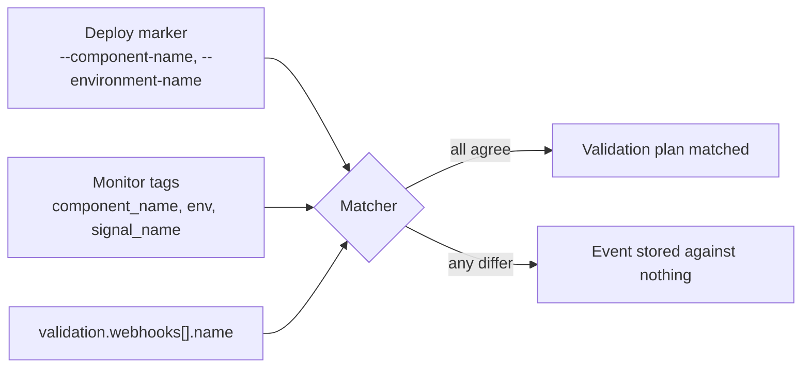

# Release validation

Validation lets a release be judged by monitoring signals after it deploys: if alerts fire
during an evaluation window, the release fails and can roll back automatically.

## Where the block goes: you must add a `type: release` job

This is the step most easily missed, and missing it breaks validation entirely.

The `validation` block lives on a **`type: release` job**, which is a **separate job from
the deploy job** — not the job that carries your markers. It is a native CircleCI job
type with no executor and no steps: just `type`, `plan_name`, and `validation`.

```yaml
jobs:
  deploy-staging:            # your normal deploy job, carries the markers
    docker:
      - image: cimg/base:stable
    steps:
      - run:
          name: Plan deployment
          command: |
            circleci run release plan component-release \
              --environment-name="staging" \
              --component-name="my-service" \
              --target-version="${APP_VERSION}"
      - run:
          name: Update deployment status to running
          command: circleci run release update component-release --status=RUNNING
      # … deploy step …
      - run:
          name: Update deployment status to failed
          command: circleci run release update component-release --status=FAILED
          when: on_fail
      # Do NOT add --status=SUCCESS here — see "Who marks SUCCESS" below.

  release-component:         # the release job, carries the validation block
    type: release
    plan_name: component-release
    validation:
      enabled: true
      webhooks:
        - name: error_rate
          provider: datadog

workflows:
  main:
    jobs:
      - deploy-staging
      - release-component:
          requires:
            - deploy-staging
```

Three things must line up, and CircleCI will not tell you in advance:

1. **`plan_name` must equal the plan name passed to `circleci run release plan`.** Above,
   both are `component-release`. This is a different string from the deploy job name.
2. **Both jobs must be in the same workflow.** `StartReleaseJob` resolves the release with
   `GetReleaseByPlan(ctx, job.WorkflowID, config.PlanName)` — the lookup is scoped to the
   workflow, so a release job in a different workflow finds nothing.
3. **The release job must run after the deploy job**, via `requires`, so the planned
   release exists by the time it starts. Copy the deploy job's branch and tag filters too,
   or the release job runs on branches where nothing was planned.

Get any of these wrong and the release job fails with **`Planned release not found`**. That
is one of the few loud failures in this system — most of the others are silent — so treat
it as a naming mismatch rather than an outage.

The minimal `validation` form above is usually the right thing to emit. Provider defaults
are applied server-side, so spelling them out locally only creates drift when they change.

## Who marks SUCCESS

When validation is enabled for a plan name, the deploy job lifecycle is **plan → RUNNING →
(deploy) → FAILED on failure only**. Do **not** emit this block on the deploy job (or in
`deploy.yml` for that plan):

```yaml
- run:
    name: Update deployment status to success
    command: circleci run release update component-release --status=SUCCESS
    when: on_success
```

CircleCI sets the release to `RUNNING` when validation starts, and to `SUCCESS` when the
validation window completes without a failing signal or the user promotes it. If the deploy
job marks `SUCCESS` first, the release is already terminal before validation starts, and
nothing moves it back to `RUNNING` — the deploys UI shows it succeeded while validation is
still listening.

Keep the deploy job's `when: on_fail` / `--status=FAILED` step — failed deploys must still
fail the release immediately.

> **Markers alone do not need a release job.** If the user wants deploy markers without
> validation, the deploy job's plan/RUNNING/SUCCESS/FAILED lifecycle is complete on its
> own. Add the `type: release` job only when validation is in scope, and say that you are
> adding it — a new job appearing in the workflow is otherwise a surprise in the diff.

## Fields

| Field | Default | Notes |
|-------|---------|-------|
| `enabled` | — | Required to opt in. Omitted or `false` means no validation runs. |
| `evaluation_time` | `20m` | Window for listening to webhook events. Expiry without failure means success. |
| `auto_rollback_on_failure` | `false` | Needs `rollback_pipeline_definition_id` set on the project. |
| `ai_provider` | `circleci` | Agentic validations only; only `circleci` is honoured today. |
| `webhooks[]` | — | One `validation_plans` row per entry. |
| `agentic[]` | — | Separate feature, out of scope here. |

Webhook entry fields:

| Field | Default | Notes |
|-------|---------|-------|
| `name` | — | Required. Must equal the monitor's `signal_name` tag. |
| `provider` | `custom` | `datadog`, `alertmanager`, `prometheus`, `grafana`, `custom`. **Not a compatibility list** — `custom` handles any tool that can POST with a header. See `monitoring.md`. |
| `data_points` | provider defaults | `variable → request.dot.path` map. Omit unless the tool's payload puts a field somewhere else. |
| `fail_when` | provider defaults | Expression over extracted points. Lowercased server-side, and may only reference `data_points` keys plus the provider's built-ins. |
| `max_failures` | `1` | Failure signals needed to fail the validation. |

Provider defaults come from `RequiredValidationWebhookMapping` and
`DefaultValidationWebhookFailExpr`. Datadog's default `fail_when` is
`criteria == "triggered" or criteria == "re-triggered"`; the Alertmanager, Prometheus, and
Grafana family use `criteria == "firing"`.

With `enabled: true` and neither `webhooks` nor `agentic` set, CircleCI injects a
system catch-all (`name: catch-all`, `provider: custom`) that matches any signal. That is
a reasonable starting point when the user has no monitors yet, and worth suggesting
instead of a name that will never match.

## The coupling that breaks setups

`webhooks[].name` must equal the `signal_name` tag on the monitor. Separately,
`component_name` and `env` extracted from the webhook must match the values in the deploy
markers **exactly** — these are exact-match filters.

So three things must agree, and nothing validates them together:



Derive all three from the same variables in one pass. Never let the user type the
component name once for markers and again for monitor tags.

Datadog `signal_name` is read from `request.tags.alert_name`, `request.tags.signal_name`,
`request.alert_name`, or `request.signal_name`. Note it is **`alert_name` with an
underscore** for Datadog, unlike the Grafana family which uses `alertname`.

`version` and `project_id` are optional in matching: when absent from the webhook, any
value matches. Do not add a static `version` tag to a monitor — a static tag cannot track
the deployed version and will simply stop matching. Only tag `version` when the monitor is
multi-alert grouped by a version tag.

## Verification, and why a synthetic POST is not enough

The ingest endpoint is:

```
POST https://circleci.com/api/v3/deploy/hooks/{ORG_UUID}/validate
```

The `hook-id` path segment is the organization UUID — the handler rejects any other value
as 403 — so the URL is knowable before any config is committed. That means monitoring can
be configured before the first deploy.

**The endpoint returns success even when no policy matches.** `processvalidationwebhook`
logs match failures rather than returning them. A synthetic POST therefore proves the URL,
the token, and the payload shape, and proves nothing at all about matching.

Only a real deploy proves matching. Finish by running a deploy and inspecting the
resulting validation plan through
`GET /api/v2/deploy/projects/{project_id}/releases`. Do not declare success at commit
time.

This silent acceptance is also why a tag typo is invisible, and why both sides must be
generated mechanically rather than typed twice.

### Running the smoke test

Merge the config, then trigger a deploy the way the project normally does — push to the
deploy branch, or trigger the registered deploy pipeline from the Deploys UI. Then walk
the chain in order, because each link fails differently:

> The commands below use the `circleci` CLI because it is the least typing. Without it,
> every one of these is visible in the web UI — the workflow view for steps 1 and 2, the
> project's Deploys page for step 3 — and step 3 also works as
> `GET /api/v2/deploy/projects/{project_id}/releases`. Walk the chain either way; do not
> skip the smoke test because the CLI is missing.

1. **Did the deploy job plan a release?** Find the run and read the marker step:

   ```bash
   circleci run list --branch <deploy-branch> --json
   circleci job output list <job-id> --json
   ```

   The `circleci run release plan` step should have succeeded.
2. **Did the release job start?** A `type: release` job appears in the workflow
   (`circleci workflow get <workflow-id> --json` lists `jobs[]`). If it failed with
   `Planned release not found`, the `plan_name` does not match — go back to
   [the release job section](#where-the-block-goes-you-must-add-a-type-release-job).
3. **Was a validation plan created?**

   ```bash
   circleci api api/v2/deploy/projects/{project_id}/releases --jq '.items[0]'
   ```

   No plan means `enabled: true` never reached CircleCI.
4. **Did the monitor deliver?** Have the user trigger the monitor and check their
   provider's webhook delivery log. A 2xx means CircleCI accepted it — which, again, does
   not mean it matched.
5. **Did the event attach to the plan?** Only this proves the setup. If the plan shows no
   signal after a delivered webhook, the tags did not match.

### When it accepts but nothing matches

The common causes, roughly in order of how often they are the answer:

| Symptom | Likely cause |
|---------|--------------|
| Webhook delivery log is empty | Monitor message is missing `@webhook-circleci-validation`. It never fired at all |
| Delivered 2xx, plan shows nothing | `component_name` or `env` tag does not exactly match the marker flags. Compare the literal strings, including case and trailing spaces |
| Delivered 2xx, plan shows nothing, tags look right | `signal_name` tag does not equal `webhooks[].name` |
| Matched on the first deploy, never again | A static `version` tag on the monitor. Remove it |
| 403 from the ingest URL | Wrong `hook-id` — it must be the org UUID — or a revoked secret |
| 401 from the ingest URL | Secret not sent as `Authorization: Bearer …`, or mistyped when pasted |
| Validation ran but never rolled back | `auto_rollback_on_failure` is unset, or no rollback pipeline is **registered** on the project |

Compare literal strings rather than eyeballing them. `prod` against `production` and a
trailing space are the two that survive review and still fail.
